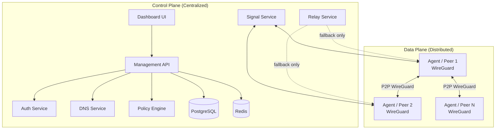

# AetherMesh Architecture

**Version**: 0.1  
**Status**: Design after deep research of NetBird, Tailscale, Headscale, ZeroTier, Nebula and industry best practices (2025–2026).

## 1. Design Principles

1. **Strict Control / Data plane separation** — control plane never sees payload traffic.
2. **Outbound-only agents** — no inbound ports required on endpoints.
3. **P2P preferred, encrypted relay fallback** — latency and privacy first.
4. **Centralized configuration as source of truth** — agents receive and apply network maps + settings.
5. **Microservices with clear boundaries** — ready for independent scaling and agentic implementation.
6. **One-action deployability** — Docker Compose primary path.
7. **Original implementation** — inspired by world-class systems, zero code copy.
8. **Security by default** — least privilege ACLs, key rotation readiness, auditability.

## 2. High-Level Architecture

## 3. Core Components

### 3.1 Agent (Client)
- Written in **Go**.
- Manages local WireGuard interface (kernel preferred, userspace fallback via wireguard-go).
- Outbound connections only to Management, Signal and Relay.
- Receives Network Map + configuration (peers, ACLs, routes, DNS, labels) via streaming gRPC / WebSocket.
- Performs ICE candidate gathering (pion/ice style) for NAT traversal.
- Applies settings atomically and reports status/metrics.
- Supports Linux (primary), Windows, macOS. Mobile later.

### 3.2 Management Service
- Authoritative source of network state, peers, groups, ACLs, routes, DNS, setup keys.
- Handles authentication, enrollment, network map distribution.
- gRPC streaming to agents for real-time config push.
- REST / OpenAPI for Dashboard and external automation.
- Store: PostgreSQL (prod) / SQLite (dev).

### 3.3 Signal Service
- Facilitates peer-to-peer connection negotiation (WebRTC ICE candidate exchange).
- Messages are end-to-end encrypted between agents; Signal only relays opaque blobs.
- Lightweight, horizontally scalable.

### 3.4 Relay Service
- Encrypted fallback path when direct P2P fails (symmetric NAT, CGNAT, etc.).
- Never decrypts user traffic (WireGuard packets only).
- Can be self-hosted or multi-region later.
- Inspired by DERP / TURN patterns but original protocol design.

### 3.5 Auth Service
- Local accounts + OIDC / SSO support.
- Setup / enrollment keys for agent provisioning.
- JWT + short-lived session tokens.

### 3.6 Dashboard
- Modern web UI (see DESIGN.md).
- Next.js + React + TypeScript + Tailwind + shadcn/ui.
- Real-time peer status, topology view, policy editor, enrollment UX.

### 3.7 Supporting Services
- **DNS**: Private MagicDNS-style resolution inside the mesh.
- **Policy Engine**: Evaluates ACLs, groups, tags, posture (future).

## 4. Key Data Flows

### Enrollment
1. Admin creates setup key in Dashboard.
2. Agent starts with setup key → authenticates to Management.
3. Management assigns WireGuard keypair / IP, returns network map.
4. Agent configures WireGuard iface and connects to Signal.

### Connection Establishment
1. Agent A wants to talk to Agent B.
2. Both gather ICE candidates via STUN.
3. Candidates exchanged via Signal (encrypted).
4. Direct UDP hole-punch attempted.
5. On success → WireGuard peer endpoint updated → P2P.
6. On failure → fall back to Relay.

### Config Push
- Management detects change (ACL, route, DNS, peer add/remove).
- Streams updated Network Map to affected agents.
- Agents apply changes without full restart where possible (`wg set`).

## 5. Technology Stack (World Best Practices 2026)

| Layer              | Choice                          | Rationale |
|--------------------|---------------------------------|---------|
| Agent & Control    | Go 1.23+                       | Performance, concurrency, single static binary, mature WireGuard ecosystem |
| Dashboard          | Next.js 15 + React + TS + Tailwind + shadcn/ui | Modern, accessible, dark-mode native, fast iteration |
| Database           | PostgreSQL 16                  | Reliability, concurrency, mature tooling |
| Cache / Pub-Sub    | Redis                          | Real-time state, rate limiting |
| Internal RPC       | gRPC                           | Streaming, efficiency |
| Public API         | REST + OpenAPI                 | Ecosystem friendliness |
| NAT Traversal      | ICE (pion) + STUN + custom Relay | Proven pattern from NetBird / WebRTC |
| TLS / Reverse Proxy| Caddy or Traefik               | Automatic HTTPS, simple config |
| Deployment         | Docker Compose + install.sh    | One-action goal |
| Observability      | Prometheus metrics (later)     | Industry standard |

## 6. Scaling & Multi-tenancy Notes

- Single-tenant self-host is MVP focus.
- Multi-tenant SaaS path prepared via account isolation in Management DB and domain routing.
- Control plane services are independently scalable.
- Data plane scales naturally with number of peers (P2P).

## 7. Security Boundaries

See `docs/SECURITY.md` for full threat model.

- Control plane trusts only authenticated agents.
- Relay is zero-knowledge for payload.
- Agents enforce ACLs locally after receiving policy.
- No trusted third-party coordination in self-host mode.

---

*Architecture decisions are locked for Sprint 0 / MVP unless strong evidence requires change. All new features must respect control/data plane separation.*
